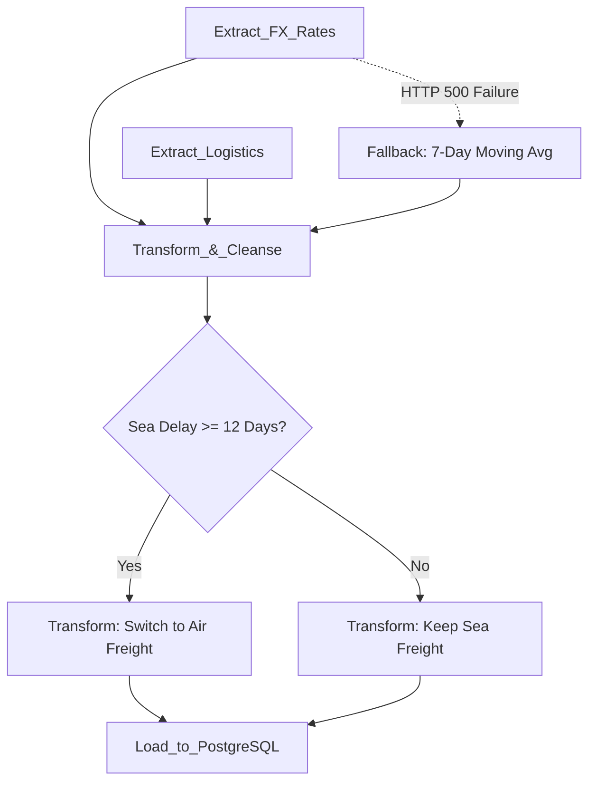

# Aurora Tech - Bloc 3: Real-Time Data Pipelines

## Overview
This repository contains the ETL (Extract, Transform, Load) pipeline deliverables orchestrated by Apache Airflow. The pipeline bridges our external data sources (FX APIs and Logistics Telemetry) with our Dockerized Data Architecture from Bloc 2.

## Directory Structure
- `/dags`: Contains the main Airflow DAG definitions (`auroratech_pipeline.py`).
- `/sql`: DDL statements for the destination PostgreSQL tables.
- `/python`: Modularized Python code (e.g., API clients) for clean Airflow tasks.
- `/tests`: Unit tests for data quality and functional components.

## Pipeline DAG Architecture Diagram



## 📊 Data Sources & Lineage
- **Cold Start Baseline (Historical Data Bootstrapping):**
  - **Financial Baseline:** Initial currency rates initialized via [Frankfurter API](https://www.frankfurter.app/).
  - **Logistics & Product Baseline:** Random Forest model baseline optimized using the [Kaggle Laptop Price Dataset](https://www.kaggle.com/datasets/muhammetvarl/laptop-price) and the [Kaggle Electronic Sales Dataset](https://www.kaggle.com/datasets/cameronseamons/electronic-sales-sep2023-sep2024) (with full GDPR compliance mapping).
- **Live Operational Pipelines (Daily Ingestion):**
  - Apache Airflow dynamically triggers daily tasks, pulling real-time exchange rates from the Frankfurter API and simulated logistics telemetry to continuously monitor current margin risk in the data warehouse.

## How to Run & Deploy
1. **Airflow Deployment**: Place `dags/auroratech_pipeline.py` into your Airflow `$AIRFLOW_HOME/dags` folder.
2. **Dependencies**: Ensure the python modules are in your PYTHONPATH:
   ```bash
   pip install -r requirements.txt
   export PYTHONPATH=$PYTHONPATH:/python
   ```
3. **Database Initialization**: Apply the SQL scripts in `/sql` to your Postgres DB.
4. **Trigger DAG**: Launch the execution via the Airflow UI on port 8080 manually or wait for the daily schedule.

## Evaluation Criteria Met & Addressed
- **Automated Orchestration**: Utilizes Apache Airflow to schedule and manage dependencies safely (Extraction -> Transformation -> Load).
- **Multi-Source Extraction**: Combines real-time financial API calls (Frankfurter EUR/USD) with simulated supply-chain telemetry (shipping delays).
- **Business Logic Integration**: Implements the complex "Ocean-to-Air" transformation logic natively in Python to adapt transport modes based on sea delay thresholds.
- **Data Quality & Observability**: Incorporates resilient error handling to fallback to historical averages when external APIs fail.

## Potential Risks & Mitigation Strategies
- **Risk: Upstream API Failures (e.g., Frankfurter API 500 Error)**: Mitigated by a Try/Except block in the Airflow task that automatically falls back to a 7-day moving average, guaranteeing zero data downtime for the downstream warehouse.
- **Risk: Task Dependency Failures**: Mitigated by strict Airflow DAG topology (e.g., `extract >> transform >> load`), ensuring downstream tasks never execute on incomplete data.
- **Risk: Duplicate Data Loading**: Mitigated by utilizing idempotent SQL inserts and Airflow's native `execution_date` context to prevent re-ingesting the same daily batch twice.

## Instructions for the Jury
1. Open `Pipeline_Plan.html` to review the defense strategy.
2. Inspect the Python code in `dags/auroratech_pipeline.py` to evaluate the Airflow logic.
3. **🎥 Demo Video (3-5 min Screencast):** View the live ETL pipelines and DAG execution run here: [Pipelines Demo Video](https://www.loom.com/share/placeholder_bloc3_demo).
