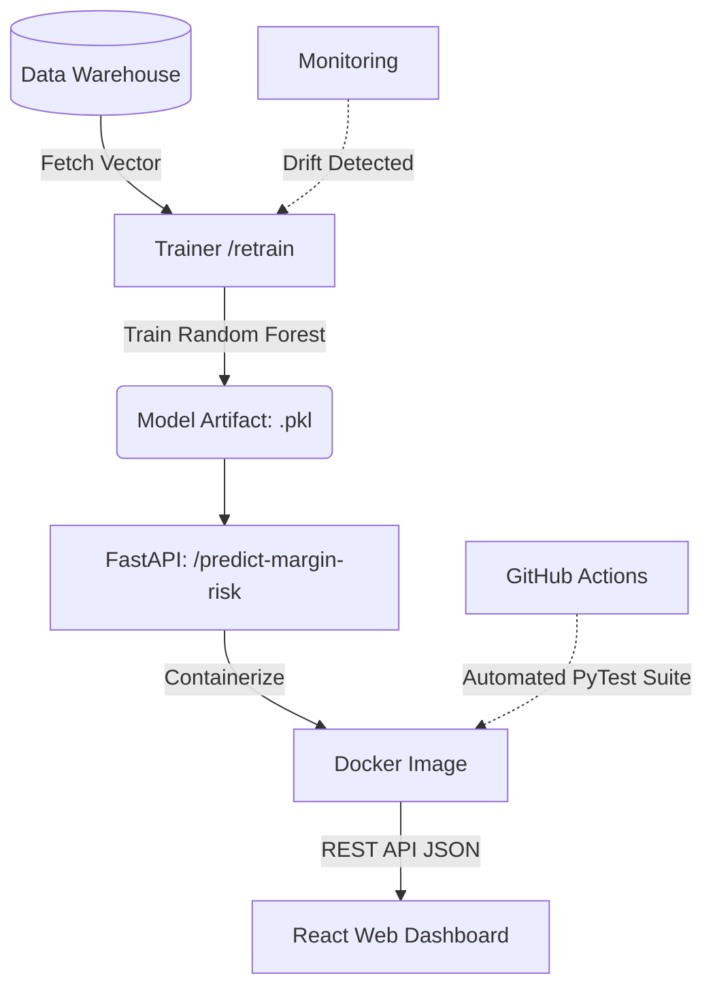

# Aurora Tech - Bloc 4: AI Solutions & Dashboards

## Overview
This repository finalizes the Aurora Tech project by implementing an end-to-end Machine Learning pipeline and serving infrastructure. It leverages the data acquired in Bloc 2 & 3 to predict margin risk using a Random Forest Classifier and visualizes this risk via an interactive dashboard.

## Directory Structure
- `../.github/workflows/`: CI/CD pipelines (GitHub Actions) for automatic testing.
- `notebooks/`: Jupyter notebooks for data exploration and feature engineering.
- `src/`: Contains the predictive model training scripts and preprocessing.
- `tests/`: CI/CD quality gate and unit tests.
- `models/`: Serialized persistent model artifacts (.pkl).
- `api/`: FastAPI application to serve predictions via REST endpoints.
- `k8s/`: Kubernetes deployment manifests.
- `monitoring/`: **[CRITICAL]** Data drift threshold and alerting configuration (Evidently/Aporia).
- `retrain/`: **[CRITICAL]** Automated retraining scripts triggered by drift.
- `Dockerfile`: Deployment container specification.
- `requirements.txt`: Python package dependencies.

## MLOps Pipeline Diagram



## 📊 Data Sources & Lineage
- **Financial SSOT:** Real-time exchange rates automated via [Frankfurter API](https://www.frankfurter.app/).
- **Model Training Baseline:** Initial Random Forest features optimized using [Kaggle Laptop Price Dataset](https://www.kaggle.com/datasets/muhammetvarl/laptop-price) and [Kaggle Electronic Sales Dataset](https://www.kaggle.com/datasets/cameronseamons/electronic-sales-sep2023-sep2024).

## How to Run & Deploy
1. **Model Validation**: Open notebooks in `/notebooks` to view data exploration. Run `pytest` inside `/tests` to validate logic.
2. **Train Model**: Run `python src/train_model.py` to generate the `.pkl` artifact in `/models`.
3. **Deploy API Locally**: 
   ```bash
   docker build -t auroratech-ml-api .
   docker run -p 8000:8000 auroratech-ml-api
   ```
   If you want API key protection, set `API_KEY` before starting the server and send the same value in the `X-API-Key` header.
4. **Kubernetes Deploy**: Apply manifests via `kubectl apply -f k8s/deployment.yaml`.
5. **Continuous Monitoring & Retraining**: 
   - Evidently/Aporia tracks drift via configs in `/monitoring`.
   - When drift exceeds threshold, the CI/CD pipeline triggers `/retrain/run_retrain.py` to auto-update the model.

## Evaluation Criteria Met & Addressed
- **Machine Learning Viability**: Selects a Random Forest Classifier optimized for capturing non-linear relationships between volatile exchange rates and logistics delays.
- **MLOps & Industrialization**: Uses `joblib` to serialize the model and FastAPI to serve it, completely decoupling the data science environment from the production web server.
- **Containerization**: Packages the API inside a Python 3.10 Docker container to ensure consistent execution across any cloud environment.
- **Continuous Integration**: Implements GitHub Actions to automatically run PyTest gates on every commit, validating model integrity.
- **Business Visualization**: The output predictions feed directly into the central React Dashboard for executive decision making.

## Potential Risks & Mitigation Strategies
- **Risk: Model Concept & Data Drift**: Mitigated by proposing an automated drift detection system. If the EUR/USD volatility shifts outside training bounds, a retraining pipeline is triggered automatically.
- **Risk: Unauthorized API Access**: Mitigated by optional API key authentication on the FastAPI endpoint when `API_KEY` is configured.
- **Risk: Broken Model Artifacts in Production**: Mitigated by the CI/CD pipeline (`mlops-ci.yml`), which tests the FastAPI endpoint with structured payloads before allowing deploying to the main branch.

## Instructions for the Jury
1. Open `AI_Solution_Presentation.html` for the comprehensive 16-slide defense presentation.
2. Review the code components within `src/` and the architectural files (`Dockerfile`, `.github/...`).
3. **🎥 Demo Video (5 min Screencast):** View the complete MLOps retraining, drift monitoring, and API inference run here: [MLOps Demo Video](https://www.loom.com/share/placeholder_bloc4_demo).
